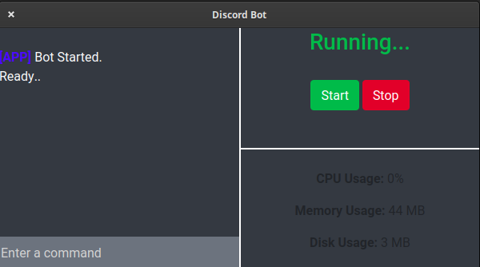
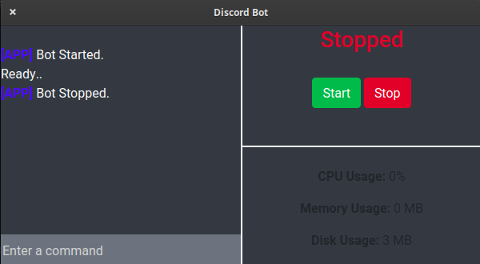

# FrontDis
Discord.JS Front-End Application

### Usage:
This Application allows you to host your Discord.JS Bot easily by a Start/Stop Button as well as Current Bot's Usage (CPU,Memory,Space)
### ScreenShot:

### Credits:
Powered by ElectronJS.
### Contributing:
Pull request.
### Support:
Discord: https://pocket-inc.ml/discord
Email: support@pocket-inc.ml

&copy; 2020 - Pocket Inc.

